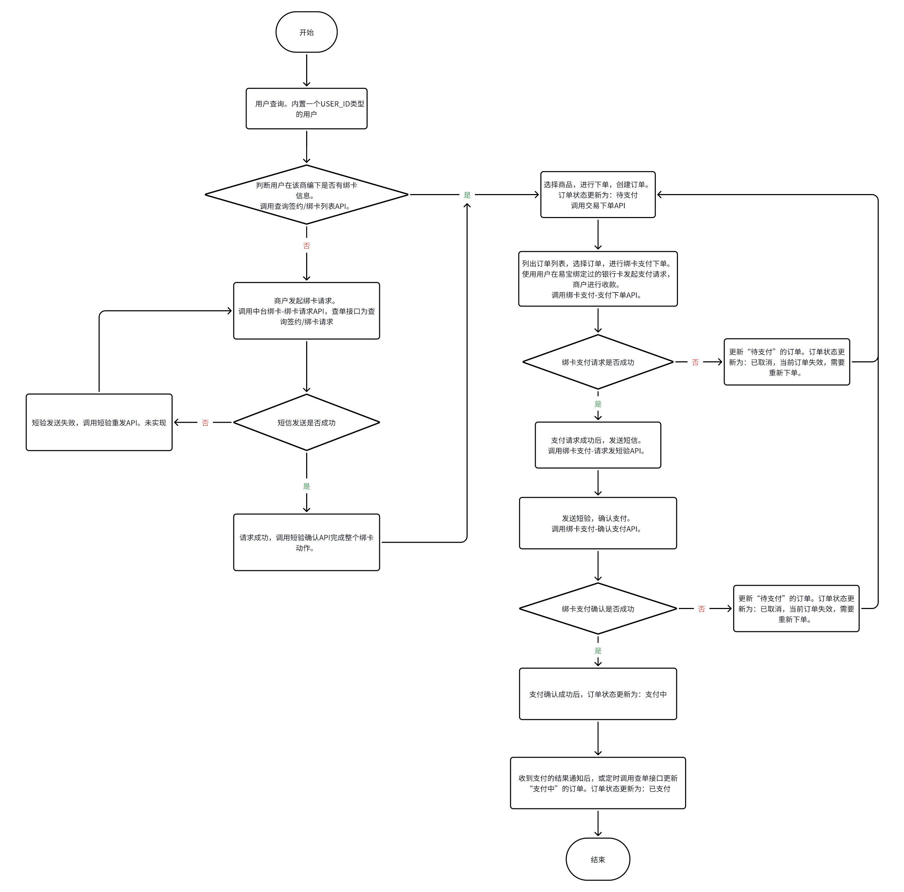

# yop-java-demo

## 一、项目介绍

此项目为商户对接易宝各种业务场景的demo项目，基于DDD（领域驱动设计）开发，采用了springboot 2.6、MyBatis-Plus、H2、Swagger
3.0等技术。目前支持的业务场景详见[下文](#scenario)。

## 二、项目结构

各模块划分如下：

``` lua
yop-java-demo
├── yop-java-demo-app -- 应用层。定义了软件要完成的任务，要尽量简单。（相对于领域层，应用层是很薄的一层）
├── yop-java-demo-client -- 客户端。用于外部依赖，作为客户端请求远程调用过程服务（RPC）所用。
├── yop-java-demo-domain -- 领域层。实现领域核心业务逻辑。
├── yop-java-demo-infrastructure -- 基础设施层。负责数据库访问、消息、外部调用等能力。
├── yop-java-demo-main -- 主模块。
└── yop-java-demo-test -- 测试。
```

## 三、如何运行

### 运行环境

为保证项目能够运行，请至少安装好以下运行环境：

1. Java 1.8+
2. Maven

### 项目启动

1.
配置密钥信息，参考[配置文件说明](https://open.yeepay.com/docs/open/platform-doc/sdk_guide-sm/java-sdk-guide-sm#%E4%B8%83-%E9%99%84%E5%BD%95-%E9%85%8D%E7%BD%AE%E6%96%87%E4%BB%B6%E8%AF%A6%E7%BB%86%E8%AF%B4%E6%98%8E)
2. 找到项目的根pom文件（根pom文件就是最外层的pom文件），右键，选择Add as Maven Project，右侧出现MAVEN菜单
3. 执行`mvn install`
4. 运行启动类`com.yeepay.yop.scenario.BindcardStarter`
5. 使用`postman`等工具，调用相关接口
6. 添加容器JVM 参数：
    1. 如果在生产环境调用，添加-Dyop.sdk.config.file=file:///home/app/yop_sdk_config_yours.json
    2. 如果在沙箱环境调用，添加-Dyop.sdk.config.file=file:///home/app/yop_sdk_config_yours.json -Dyop.sdk.http=true
       -Dyop.sdk.config.env=qa -Dyop.sdk.mode=sandbox

## 四、使用手册

### 接口文档

项目本地启动后，访问`http://localhost:8080/swagger-ui/index.html`

### <a id="scenario">业务场景</a>

1. [绑卡支付](#bindcard)

2. 等...

#### 1、<a id="bindcard">绑卡支付</a>

##### 流程图



##### 具体步骤

1. 用户管理-用户查询：/rest/user/detail。

   ```text
   curl --location 'http://localhost:8080/rest/user/detail?userId=your userId'
   ```

2.
用户管理-查询用户的签约/绑卡列表：/rest/user/bind-card-list。封装[易宝开放平台-查询签约/绑卡列表API](https://open.yeepay.com/docs/apis/bzshsfk/options__rest__v1.0__frontcashier__bindcard__bindcardlist)。

```text
curl --location --request POST 'http://localhost:8080/rest/user/bind-card-list?userId=your userId&merchantNo=your merchantNo&userType=your userType'
```
3.
绑卡操作-绑卡请求：/rest/bind-card/request。封装[易宝开放平台-中台绑卡-绑卡请求API](https://open.yeepay.com/docs/apis/bzshsfk/options__rest__v2.0__frontcashier__bindcard__request)。

```text
curl --location 'http://localhost:8080/rest/bind-card/request' \
--header 'Content-Type: application/json' \
--data '{
"parentMerchantNo": "your parentMerchantNo",
"merchantNo": "your merchantNo",
"merchantFlowId": "your merchantFlowId",
"userNo": "your userNo",
"userType": "your userType",
"bankCardNo": "your bankCardNo",
"userName": "your userName",
"idCardNo": "your idCardNo",
"phone": "your phone",
"cardType": "your cardType",
"authType": "your authType"
}'
```
4.
绑卡操作-绑卡短验确认：/rest/bind-card/confirm。封装[易宝开放平台-中台绑卡-短验确认API](https://open.yeepay.com/docs/apis/bzshsfk/options__rest__v2.0__frontcashier__bindcard__confirm)。

```text
curl --location 'http://localhost:8080/rest/bind-card/confirm' \
--header 'Content-Type: application/json' \
--data '{
"parentMerchantNo": "your parentMerchantNo",
"merchantNo": "your merchantNo",
"merchantFlowId": "your merchantFlowId",
"smsCode": "your smsCode"
}'
```
5.
订单管理-下单：/rest/order/create。封装[易宝开放平台-交易下单API](https://open.yeepay.com/docs/apis/bzshsfk/options__rest__v1.0__trade__order)。

```text
curl --location 'http://localhost:8080/rest/order/create' \
--header 'Content-Type: application/json' \
--data '{
"parentMerchantNo": "your parentMerchantNo",
"merchantNo": "your merchantNo",
"orderId": "your orderId",
"orderAmount": "0.01",
"goodsName": "your goodsName",
"notifyUrl": "https://your ip:your port/yop-callback/rest/bind-pay/call-back/result",
"expiredTime": "example:2023-10-31 23:59:59",
"userId": "your userId"
}'
```
6.
订单管理-查询易宝订单：/rest/order/query。封装[易宝开放平台-查询订单API](https://open.yeepay.com/docs/apis/bzshsfk/options__rest__v1.0__trade__order__query)。

```text
curl --location 'http://localhost:8080/rest/order/query?orderId=your orderId&merchantNo=your merchantNo&parentMerchantNo=your parentMerchantNo'
````
7. 订单管理-查询商编下用户的所有订单：/rest/order/list。

   ```text
   curl --location 'http://localhost:8080/rest/order/list?userId=your userId&merchantNo=your merchantNo'
   ```
8. 订单管理-订单详情：/rest/order/detail。

   ```text
   curl --location 'http://localhost:8080/rest/order/detail?orderId=your orderId'
   ```
9.
绑卡支付操作-支付下单：/rest/bind-pay/request。封装[易宝开放平台-绑卡支付-支付下单API](https://open.yeepay.com/docs/apis/bzshsfk/options__rest__v1.0__frontcashier__bindpay__request)、[易宝开放平台-绑卡支付-请求发短验API](https://open.yeepay.com/docs/apis/bzshsfk/options__rest__v1.0__frontcashier__bindpay__sendsms)。

```text
curl --location 'http://localhost:8080/rest/bind-pay/request' \
--header 'Content-Type: application/json' \
--data '{
"token": "your token",
"bindId": "your bindId",
"userNo": "your userNo",
"userType": "your userType",
"userIp": "your userIp",
"version": "1.0"
}'
```
10.
绑卡支付操作-确认支付：/rest/bind-pay/confirm。封装[易宝开放平台-绑卡支付-确认支付API](https://open.yeepay.com/docs/apis/bzshsfk/options__rest__v1.0__frontcashier__bindpay__confirm)。

```text
curl --location 'http://localhost:8080/rest/bind-pay/confirm' \
--header 'Content-Type: application/json' \
--data '{
"token": "your token",
"version": "1.0",
"userNo": "your userNo"
}'
```
11.
支付结果通知：/yop-callback/rest/bind-pay/call-back/result。用于接收支付结果，对接文档：[结果通知快速对接网关](https://open.yeepay.com/docs/open/platform-doc/notifys/yop-isv-gateways-sm)。

> 注：结果通知目前接收不到。可以联系技术支持查询报文，手动发起结果通知。

```text
curl --location 'http://localhost:8080/yop-callback/rest/bind-pay/call-back/result' \
--header 'Content-Type: application/json' \
--data '{
"response": "your response",
"customerIdentification": "your customerIdentification"
}'
```
12.
定时查单。封装[易宝开放平台-查询订单API](https://open.yeepay.com/docs/apis/bzshsfk/options__rest__v1.0__trade__order__query)。

## 许可证

[Apache License 2.0](LICENSE)


